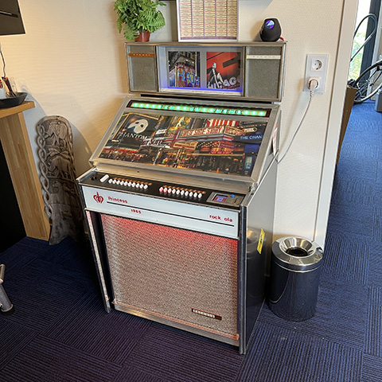

**ESP32-Sonos-Jukebox**

This project is all about pimping up an old jukebox or wallbox to use it with a Sonos mediaplayer. 
You can use the jukebox to select and play songs from a stored playlist or select a radiostation.
I use the Arduino IDE for this project.

If you plan to use it, it probably needs work to adapt to your own creation. 

This package uses various other github repositories and libraries. 
Many thanks to all creators of these fanstastic resources!
I would never got this far without it.

**Some of the Libraries used:**

 * TFT_eSPI by Bodmer for the LCD display
 * ESP_WiFiManager by Khoih for setting up wifi credentials
 * Fastled library to drive the pixelled stuff
 * Arduino OTA to upload code over Wifi rather than USB cable

**It uses an ESP32 Dev Kit module and has the following features:**

 * reads the selection keys of the jukebox. Two rows of 10 keys are read by just 2 analog inputs.
For this, there are voltage diviver resistors mounted on the switches. This reduces the number of wires to the ESP32.
 * uses a TFT display to give some feedback about the song playing, radio station, volume setting etc.
 * uses a encoder knob to control the volume for the Sonos.
 * uses neopixels leds to illuminate the keys, just for fun.
 * uses an SD card to store some artwork and music files, but as a music source a sonos playlist is recommended.
 * has a webserver that can produce printable jukebox 1" by 3" strips to insert in the slots of your jukebox or wallbox
 * led matrix to display song title or radio content information

To get yourself started, it is a good idea to connect a TFT display, an encoder knob and an SD card. Copy all files from the SD-CARD-Content folder to your SD card. You can add your own music files. There is some information about that in the source files, how their names should be formattted.

The main file is Sonos_Controller_ESP32-V3-ASYNC.ino and also tells which I/O pins to use for the TFT display, encoder knob and SD card. In readjukkeys there are instructions how to wire the jukebox keys and also how you could add some volume up/down buttons on a wallbox. 

This is a work in progress. It is quite a mess really and needs fixes in many places.
Provided as is.  

Youtube:
  * Jukebox - https://www.youtube.com/watch?v=mL4axSTkN0s
  * Led Marix - https://www.youtube.com/watch?v=HMJUrEQusU4

Enjoy!

